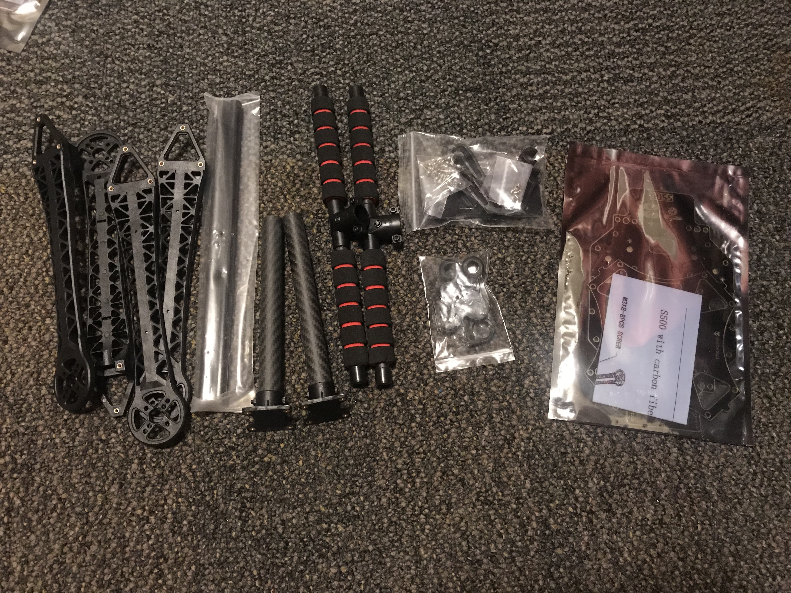
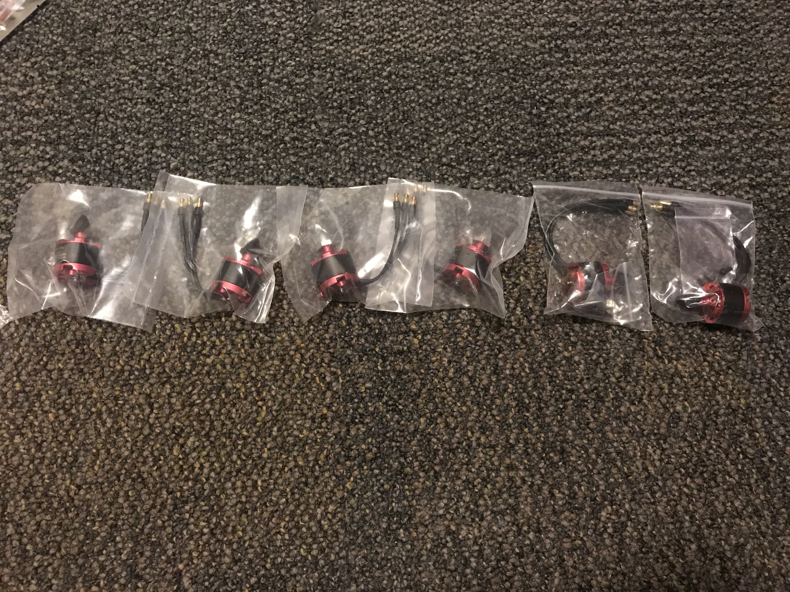
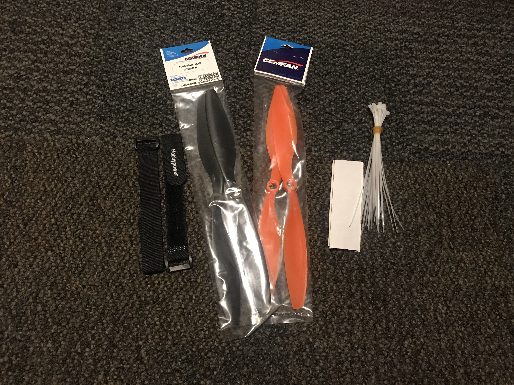
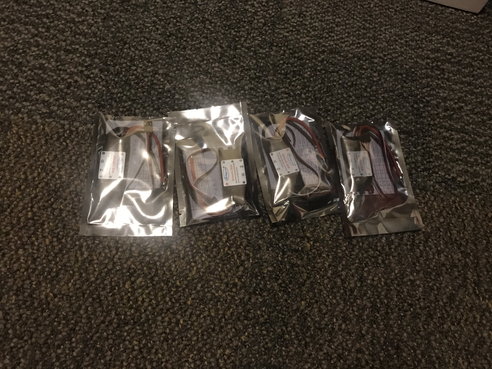
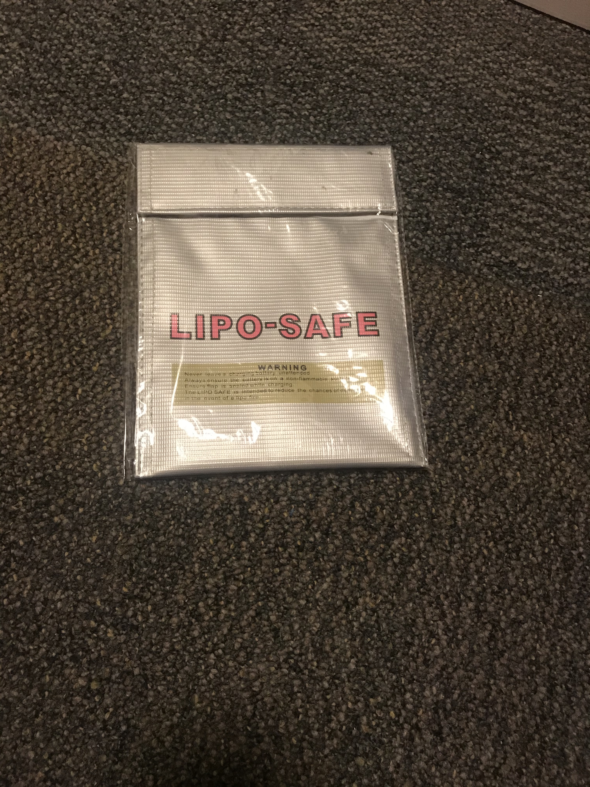

Kit Hardware
=========================================

This is a brief run-down on the components that will be found when you open the kit box.

.. image:: ../source/Pictures/unwrapped.jpg
   :width: 300px
   :height: 200px
   :align: center

Autopilot/Radios/Electronics
****************

Inside the kit, there are two sets of autopilots, a transmitter/receiver combo, two GPS units, and 900MHz telemetry radio system. The two autopilots are the Pixhawk and the APM 2.8. Because of the more delicate nature of the Pixhawk as well as its GPS unit, both of them and the 900MHz telemetry radios have been placed into the transmitter/receiver box to ensure that they are not damaged upon shipping.

.. image:: ../source/Pictures/radio-pixhawk.jpg
   :width: 200px
   :height: 100px
   :align: center

The two autopilots are provided so that teams can experiment with the different capabilities of the autopilots without worrying about losting one of them. The Pixhawk is the more advanced variant of the APM 2.8, so please keep that in mind when assembling.

There are two sets of power distribution lines (the thick red/black wires connected to a circuit board in  the middle). That will be used to power the Pixhawk/APM 2.8 during flight as well as pass the battery power to the board.

Frame
********
The frame components can be see in the following pictures. This is the S500 frame with a built-in power distribution board. Teams will need to solder the ESC connections into the board itself. More details on frame assembly can be found here: https://www.youtube.com/watch?v=ibXNw8jLwBs

Motors
*********
The kit provides 4 motors as well as 2 additional spare motors as shown in this picture.

Propellers/Accessories
***********
The kit provides 4 different 

ESC
********
The kit provides 4 ESCs.

Batteries
********
The kit provides with a team with two 2200mAh 3C batteries as well as a battery charger. The batteries should provide approximately 10 minutes of flight. Teams are allowed to buy their own larger batteries if they prefer.

.. image:: ../source/Pictures/electrical_stuff.jpg
   :width: 200px
   :height: 100px
   :align: center

A lipo bag is also provided so that teams can store their batteries safely. Always remember to place the batteries back into the provided bags so that if something goes wrong, the damage can be contained.

