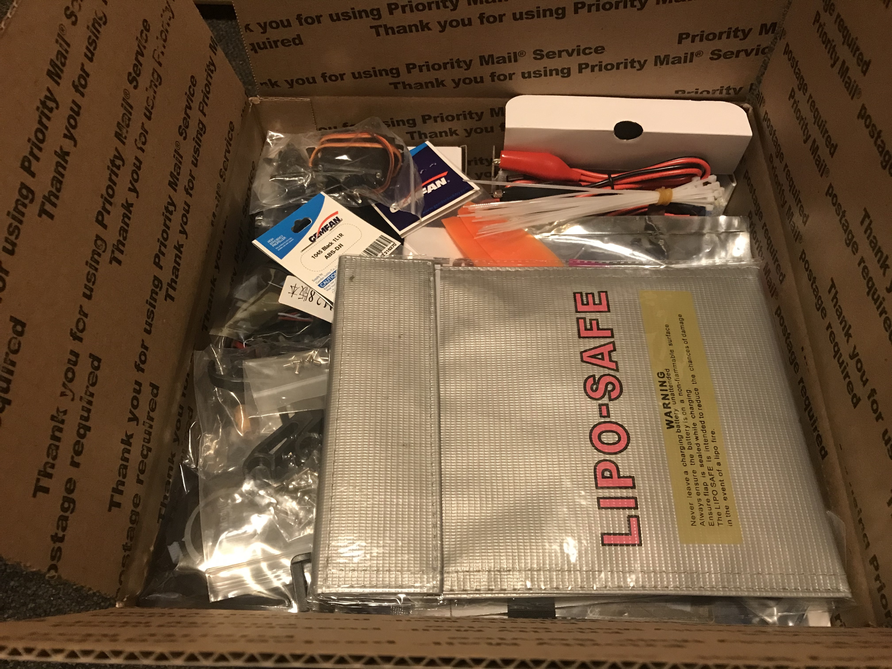

Kit Hardware
=========================================

This is a brief run-down on the components that will be found when you open the kit box.

Autopilot/Radios/Electronics
****************

Inside the kit, there are two sets of autopilots, a transmitter/receiver combo, two GPS units, and 900MHz telemetry radio system. The two autopilots are the Pixhawk and the APM 2.8. Because of the more delicate nature of the Pixhawk as well as its GPS unit, both of them and the 900MHz telemetry radios have been placed into the transmitter/receiver box to ensure that they are not damaged upon shipping.

.. image:: Pictures/radio-pixhawk.jpg
   :width: 200px
   :height: 100px
   :scale: 50 %
   :alt: alternate text
   :align: center

Frame
********
The frame components can be see in the following pictures. This is the S500 frame with a built-in power distribution board. Teams will need to solder the ESC connections into the board itself.

Motors
*********
The kit provides 

Propellers
***********

ESC
********

Batteries
********

